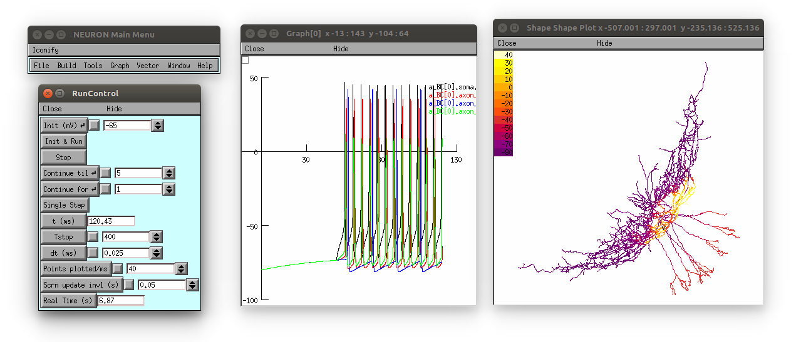

## NeuroML 2 version of model

To recreate NeuroML files (install [libNeuroML](https://github.com/NeuralEnsemble/libNeuroML) first):

     # Exports cell model from NEURON & writes *.cell.nml
     python CreateCellModel.py   

     # Generates a NeuroML network file (*net.nml) using the above cell and a current 
     # input and creates a LEMS simulation (LEMS*.xml to run it) 
     python CreateNetwork.py      

To run the simulation (install [jNeuroML](https://github.com/NeuroML/jNeuroML)):

    jnml LEMS_Test.xml -neuron
    nrnivmodl
    nrngui LEMS_Test_nrn.py

  
